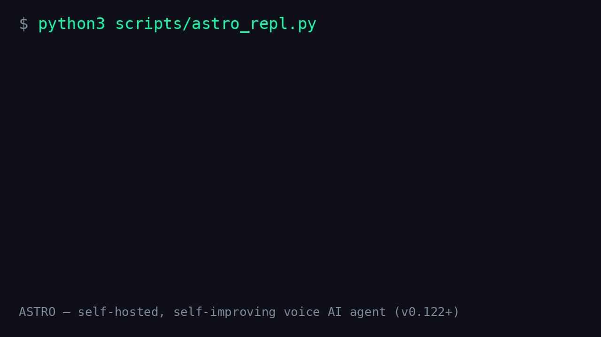

# ASTRO — self-hosted, self-improving voice AI agent

[](https://github.com/mobium-app/ai_astro_public/actions)
[](LICENSE)
[](requirements.txt)
[]()
[]()
[](https://netrunner.edu.pl/projekt-astro)

**ASTRO** to samodzielny agent głosowy typu open-core: słyszy, mówi, widzi,
wykonuje komendy na swoim urządzeniu, uczy się w trakcie pracy i trenuje własne
modele (LoRA). Zbudowany od zera jako czysty, testowalny SDK — bez chmury
obowiązkowej (offline-first, NPU-first).

> 🌐 **Projekt ASTRO — strona komercyjna: [netrunner.edu.pl/projekt-astro](https://netrunner.edu.pl/projekt-astro)**

> To jest publiczne lustro projektu. Repozytorium źródłowe (prywatne) zawiera
> dane osobiste i logi, dlatego publiczny snapshot jest **sanityzowany**: IP,
> ścieżki i sekrety zastąpiono placeholderami. Kod jest w 100% realny i testowalny.

## Demo



🎧 **Próbka głosu ASTRO** (TTS Piper, profil „dziewczynka"): [posłuchaj](assets/astro_voice_sample.wav)

## Po co istnieje
- **Prywatny asystent w domu**: budzi się na „Hej Astro", rozumie polską mowę
  (Vosk + Whisper na NPU), odpowiada głosem (Piper), wykonuje komendy systemowe.
- **Samodoskonalenie**: pętla nauki zadaje pytania, zbiera wiedzę do lokalnej
  bazy (`learned`), destyluje trajektorie i trenuje własne adaptery LoRA.
- **Widzi otoczenie**: kamera sieciowa (ONVIF/RTSP), detekcja obiektów i twarzy,
  rozpoznawanie osób, OCR, wiek/płeć, zdarzenia ruchu, opis sceny VLM.
- **Offline-first**: na Raspberry Pi z Hailo-10H NPU działa bez internetu;
  PC/klucze chmurowe są opcjonalne (wspomaganie, nie wymóg).

## Wymagany sprzęt (referencyjny)
| Komponent | Referencja | Uwagi |
|---|---|---|
| SBC | Raspberry Pi 5 (8 GB, Debian 13) | ARM64, Python 3.12+ |
| NPU | Hailo-10H (AI HAT+ 2) | STT Whisper, czat VLM, detekcja YOLO/SCRFD |
| Audio | WM8960 HAT + mikrofon/głośnik | wake word, STT, TTS |
| Kamera | Dowolna IP (ONVIF/RTSP) | opcjonalna — ocena otoczenia, twarze, OCR |
| PC z GPU (opcjonalnie) | RTX 4060+ (Kali/Linux) | trening LoRA, nauczyciel wiedzy |

Kod działa **bez NPU, kamery i PC** (fallback CPU + symulacje w testach) —
ale pełny UX wymaga zestawu referencyjnego.

## Quickstart
```bash
# UWAGA: katalog docelowy musi nazywać się `astro` (pakiet Python importuje `astro.*`)
git clone https://github.com/mobium-app/ai_astro_public.git astro
cd astro
pip install -r requirements.txt

# konfiguracja (wzorce — uzupełnij własnymi wartościami)
cp config/machines.env.example config/machines.env

# testy (hermetyczne, bez sprzętu)
python3 tests/run_tests.py

# czat tekstowy
python3 scripts/astro_repl.py
```

## Architektura (skrót)
- `backends/` — silniki: CPU, NPU (Hailo), PC (Ollama przez tunel), remote (opcjonalne).
- `core/` — pętla observe→act→verify, dispatch intencji, tryby pracy (offline/komputer/premium).
- `tools/` — rejestr narzędzi (system, sieć, pliki, kamera, wiedza) + bramki bezpieczeństwa.
- `audio/` — wake word, STT (Vosk/Whisper NPU/CPU), TTS (Piper), streaming.
- `vision/` — detekcja (YOLO/SCRFD na NPU lub CPU), twarze (SFace), OCR, wiek/płeć, VLM.
- `memory/` — SQLite `memory.db`: wiedza wektorowa (`learned`), trajektorie, sesje, biometria (AES-GCM).
- `safety/` — reguły: komendy nigdy do chmury, twarde odmowy, ochrona sekretów.
- `skills/` — receptury komend deterministycznych (must-have, bez modelu).
- `scripts/` — bramki jakości (E1–E9), trening LoRA, destylacja, audyt must-have.

## Testy i jakość
```bash
python3 tests/run_tests.py      # ~990 hermetycznych testów (stdlib unittest)
python3 scripts/must_have_audit.py   # audyt komend głosowych
python3 scripts/e6_gate.py --model <tag> --url http://127.0.0.1:11434 \
  --runtime-prompt --max-tools 6 --temp 0 --seed 42 --no-baseline --quick
```
Promocja modelu odbywa się wyłącznie po zaliczeniu bramek (tools/chain/chat) —
bez regresji względem baseline.

## Jak pomóc
- Zgłoś błąd / pomysł: issue lub PR (patrz `CONTRIBUTING.md`).
- Luki bezpieczeństwa: `SECURITY.md` (nie w publicznych issue).
- Najbardziej przydatne obszary: STT/TTS, nowe narzędzia, komendy PL, trening LoRA.

## Licencja
MIT — patrz `LICENSE`.

## Projekt komercyjny
ASTRO to także komercyjny projekt — strona projektu: **[netrunner.edu.pl/projekt-astro](https://netrunner.edu.pl/projekt-astro)**.

## Status
Snapshot `public-YYYY-MM-DD` (wersja prywatna v0.122+). Publiczne repo jest
aktualizowane skryptem mirrorującym; prywatny rdzeń może zawierać postęp
ponad snapshot.